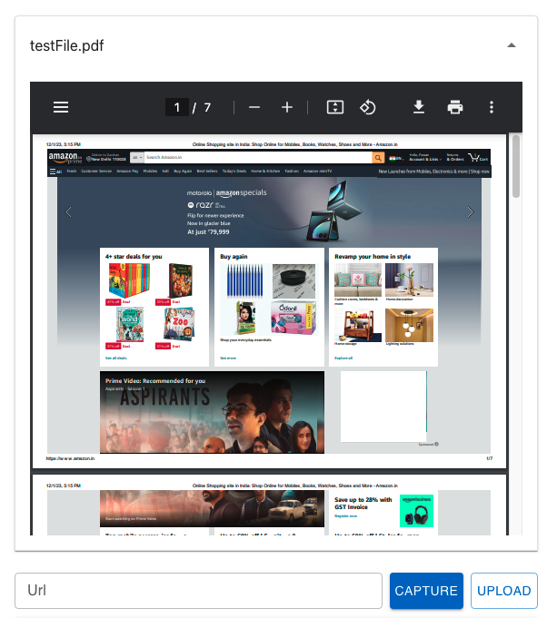

| **Name** | **Description**                                                      | **e.g**                 |
| -------- | -------------------------------------------------------------------- | ----------------------- |
| id       | This id will be put as the name of the field / input element         | ✔️                      |
| type     | The type of the field                                                | checkbox                |
| prefix   | This field will be put as the label before the field                 |                         |
| suffix   | This field will be put as the label after the field                  |                         |
| Label    | Label of the field                                                   | Hobby                   |
| options  | The options array will be render as multiple Radio Button to select. | ['cricket', 'football'] |
| child    | The child of the field                                               | [Child](#child)         |
| rules    | Validation rule for this field.                                      | [Rules](#rules)         |

### Rules

```json
  "rules": {
      "required": {
        "value": true,
        "message": "Please select hobby"
      }
    }
```

### Child

```json
{
  "id": "1",
  "label": "Hobby",
  "type": "checkbox",
  "placeholder": "",
  "options": ["cricket", "football"],
  "rules": {
    "required": {
      "value": true,
      "message": "Please choice hobby"
    },
    "min": null,
    "max": null,
    "pattern": null,
    "minLength": null,
    "maxLength": null
  },
  "child": [
    {
      "match": "cricket",
      "field": {
        "id": "8",
        "label": "Test",
        "placeholder": "test",
        "type": "text",
        "multiple": false,
        "prefix": null,
        "suffix": null,
        "width": null,
        "multiline": false,
        "value": "",
        "api": "",
        "options": null,
        "rules": null,
        "child": null
      }
    }
  ]
}
```

## Preview


