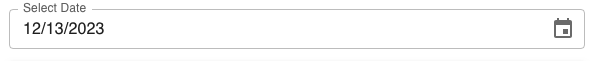

| **Name** | **Description**                                              | **e.g**         |
| -------- | ------------------------------------------------------------ | --------------- |
| id       | This id will be put as the name of the field / input element | ✔️              |
| type     | The type of the field                                        | date            |
| prefix   | This field will be put as the label before the field         | prefix string   |
| suffix   | This field will be put as the label after the field          | suffix string   |
| Label    | Label of the field                                           | Select Date     |
| format   | Formate of the date                                          | MM/DD/YYY       |
| rules    | Validation rule for this field.                              | [Rules](#rules) |

### Rules

```json
  "rules": {
      "required": {
        "value": true,
        "message": "Please select date"
      }
    }
```

## Preview


