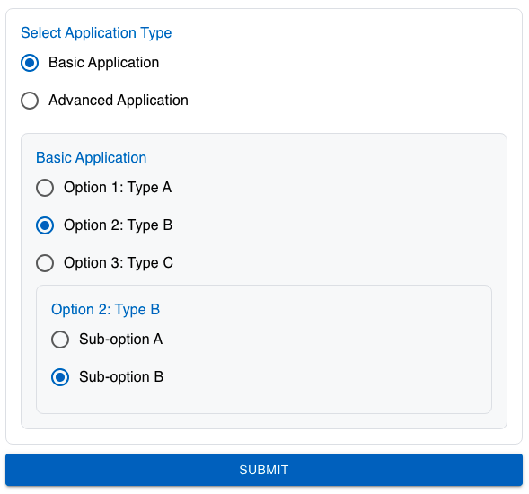

| **Name** | **Description**                                                      | **e.g**                                       |
| -------- | -------------------------------------------------------------------- | --------------------------------------------- |
| id       | This id will be put as the name of the field / input element         | ✔️                                            |
| type     | The type of the field                                                | radio-options                                 |
| prefix   | This field will be put as the label before the field                 | prefix string                                 |
| suffix   | This field will be put as the label after the field                  | suffix string                                 |
| Label    | Label of the field                                                   | Gender                                        |
| options  | The options array will be render as multiple Radio Button to select. | ['Basic Application', 'Advanced Application'] |
| child    | The child of the field                                               | [Child](#child)                               |
| rules    | Validation rule for this field.                                      | [Rules](#rules)                               |

### Rules

```json
  "rules": {
      "required": {
        "value": true,
        "message": "Please select application"
      }
    }
```

### Child

```json
{
  "parentid": "",
  "id": "222",
  "label": "Select Application Type",
  "placeholder": "Choose the type of application",
  "type": "radio",
  "value": "",
  "IsVisible": true,
  "options": ["Basic Application", "Advanced Application"],
  "child": [
    {
      "parentid": "222",
      "id": "223",
      "label": "Basic Application",
      "placeholder": "Choose Basic Application type",
      "type": "radio-options",
      "value": "",
      "IsVisible": true,
      "options": ["Option 1: Type A", "Option 2: Type B", "Option 3: Type C"],
      "child": [
        {
          "parentid": "223",
          "id": "216",
          "label": "Option 1: Type A",
          "placeholder": "Type A details",
          "type": "section",
          "value": "",
          "IsVisible": true,
          "options": [],
          "child": [
            {
              "parentid": "216",
              "id": "217",
              "label": "Country",
              "placeholder": "Select Country",
              "type": "select",
              "value": "UK",
              "IsVisible": true,
              "options": ["UK", "Canada", "India"],
              "child": [],
              "multiple": false,
              "prefix": "",
              "suffix": "",
              "width": "",
              "format": "",
              "multiline": false,
              "rules": null,
              "api": ""
            },
            {
              "parentid": "216",
              "id": "219",
              "label": "Owner Name",
              "placeholder": "Enter Owner's Name",
              "type": "text",
              "value": "Jane Doe",
              "IsVisible": true,
              "options": [],
              "child": [],
              "multiple": false,
              "prefix": "",
              "suffix": "",
              "width": "",
              "format": "",
              "multiline": false,
              "rules": null,
              "api": ""
            }
          ],
          "multiple": false,
          "prefix": "",
          "suffix": "",
          "width": "",
          "format": "",
          "multiline": false,
          "rules": null,
          "api": ""
        },
        {
          "parentid": "223",
          "id": "224",
          "label": "Option 2: Type B",
          "placeholder": "Type B details",
          "type": "radio",
          "value": "",
          "IsVisible": true,
          "options": ["Sub-option A", "Sub-option B"],
          "child": [],
          "multiple": false,
          "prefix": "",
          "suffix": "",
          "width": "",
          "format": "",
          "multiline": false,
          "rules": null,
          "api": ""
        },
        {
          "parentid": "223",
          "id": "500",
          "label": "Option 3: Type C",
          "placeholder": "Type C details",
          "type": "text",
          "value": "Some details for Type C",
          "IsVisible": true,
          "options": [],
          "child": [],
          "multiple": false,
          "prefix": "",
          "suffix": "",
          "width": "",
          "format": "",
          "multiline": false,
          "rules": null,
          "api": ""
        },
        {
          "parentid": "223",
          "id": "504",
          "label": "Other Option",
          "placeholder": "Other details",
          "type": "section",
          "value": "",
          "IsVisible": true,
          "options": [],
          "child": [
            {
              "parentid": "504",
              "id": "505",
              "label": "Text Field Example",
              "placeholder": "Enter text here",
              "type": "text",
              "value": "Example Text",
              "IsVisible": true,
              "options": [],
              "child": [],
              "multiple": false,
              "prefix": "",
              "suffix": "",
              "width": "",
              "format": "",
              "multiline": false,
              "rules": null,
              "api": ""
            },
            {
              "parentid": "504",
              "id": "506",
              "label": "Radio Button Example",
              "placeholder": "Choose one option",
              "type": "radio",
              "value": "",
              "IsVisible": true,
              "options": ["Choice 1", "Choice 2"],
              "child": [],
              "multiple": false,
              "prefix": "",
              "suffix": "",
              "width": "",
              "format": "",
              "multiline": false,
              "rules": null,
              "api": ""
            },
            {
              "parentid": "504",
              "id": "507",
              "label": "Checkbox Example",
              "placeholder": "Select multiple options",
              "type": "checkbox",
              "value": "",
              "IsVisible": true,
              "options": ["Option A", "Option B", "Option C"],
              "child": [],
              "multiple": false,
              "prefix": "",
              "suffix": "",
              "width": "",
              "format": "",
              "multiline": false,
              "rules": null,
              "api": ""
            }
          ],
          "multiple": false,
          "prefix": "",
          "suffix": "",
          "width": "",
          "format": "",
          "multiline": false,
          "rules": null,
          "api": ""
        }
      ],
      "multiple": false,
      "prefix": "",
      "suffix": "",
      "width": "",
      "format": "",
      "multiline": false,
      "rules": null,
      "api": ""
    },
    {
      "parentid": "222",
      "id": "224",
      "label": "Advanced Application",
      "placeholder": "Choose Advanced Application",
      "type": "radio",
      "value": "",
      "IsVisible": true,
      "options": ["Option X", "Option Y"],
      "child": [],
      "multiple": false,
      "prefix": "",
      "suffix": "",
      "width": "",
      "format": "",
      "multiline": false,
      "rules": null,
      "api": ""
    }
  ],
  "multiple": false,
  "prefix": "",
  "suffix": "",
  "width": "",
  "format": "",
  "multiline": false,
  "rules": null,
  "api": ""
}
```

## Preview


