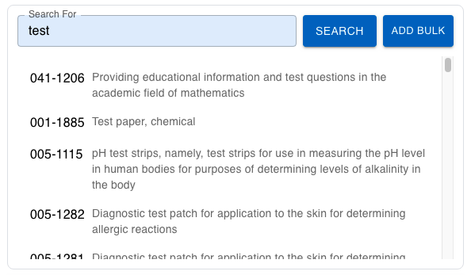

| **Name** | **Description**                                              | **e.g**           |
| -------- | ------------------------------------------------------------ | ----------------- |
| id       | This id will be put as the name of the field / input element | ✔️                |
| type     | The type of the field                                        | search            |
| prefix   | This field will be put as the label before the field         |                   |
| suffix   | This field will be put as the label after the field          |                   |
| Label    | Label of the field                                           | Search code       |
| value    | The api of field.                                            | Your API endpoint |
| options  | The placeholder of the field.                                | Enter code        |
| rules    | Validation rule for this field.                              | [Rules](#rules)   |

### Rules

```json
    "rules": {
        "required": {
          "value": true,
          "message": "Please select 3 value"
        },
        "minLength": {
          "value": 3,
          "message": "Value not less then 3"
        },
        "maxLength": {
          "value": 5,
          "message": "Value not more then 5"
        }
    }
```

## Preview


