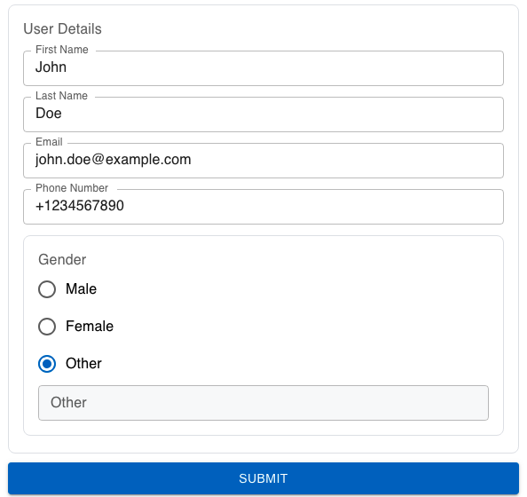

| **Name** | **Description**                                              | **e.g**         |
| -------- | ------------------------------------------------------------ | --------------- |
| id       | This id will be put as the name of the field / input element | ✔️              |
| type     | The type of the field                                        | section         |
| prefix   | This field will be put as the label before the field         | prefix string   |
| suffix   | This field will be put as the label after the field          | suffix string   |
| Label    | Label of the field                                           | Gender          |
| child    | The child of the field                                       | [Child](#child) |

### Child

```json
{
  "parentid": "229",
  "id": "340",
  "label": "User Details",
  "placeholder": "User Details",
  "type": "section",
  "value": "",
  "IsVisible": true,
  "options": [],
  "multiple": false,
  "prefix": "",
  "suffix": "",
  "width": "",
  "format": "",
  "multiline": false,
  "rules": null,
  "api": "",
  "child": [
    {
      "parentid": "340",
      "id": "230",
      "label": "First Name",
      "placeholder": "First Name",
      "type": "text",
      "value": "John",
      "IsVisible": true,
      "child": [],
      "multiple": false,
      "prefix": "",
      "suffix": "",
      "width": "",
      "format": "",
      "multiline": false,
      "rules": null,
      "api": ""
    },
    {
      "parentid": "340",
      "id": "231",
      "label": "Last Name",
      "placeholder": "Last Name",
      "type": "text",
      "value": "Doe",
      "IsVisible": true,
      "child": [],
      "multiple": false,
      "prefix": "",
      "suffix": "",
      "width": "",
      "format": "",
      "multiline": false,
      "rules": null,
      "api": ""
    },
    {
      "parentid": "340",
      "id": "232",
      "label": "Email",
      "placeholder": "Email Address",
      "type": "text",
      "value": "john.doe@example.com",
      "IsVisible": true,
      "child": [],
      "multiple": false,
      "prefix": "",
      "suffix": "",
      "width": "",
      "format": "",
      "multiline": false,
      "rules": null,
      "api": ""
    },
    {
      "parentid": "340",
      "id": "233",
      "label": "Phone Number",
      "placeholder": "Phone Number",
      "type": "text",
      "value": "+1234567890",
      "IsVisible": true,
      "child": [],
      "multiple": false,
      "prefix": "",
      "suffix": "",
      "width": "",
      "format": "",
      "multiline": false,
      "rules": null,
      "api": ""
    },
    {
      "parentid": "340",
      "id": "238",
      "label": "Gender",
      "placeholder": "Select Gender",
      "type": "radio",
      "value": "Male",
      "IsVisible": true,
      "options": ["Male", "Female", "Other"],
      "child": [
        {
          "parentid": "238",
          "id": "239",
          "label": "Other",
          "placeholder": "Enter gender",
          "type": "text",
          "value": "",
          "IsVisible": true,
          "child": []
        }
      ],
      "multiple": false,
      "prefix": "",
      "suffix": "",
      "width": "",
      "format": "",
      "multiline": false,
      "rules": null,
      "api": ""
    }
  ]
}
```

## Preview


