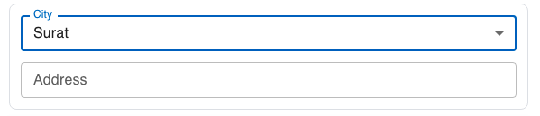

| **Name** | **Description**                                                                                              | **e.g**                |
| -------- | ------------------------------------------------------------------------------------------------------------ | ---------------------- |
| id       | This id will be put as the name of the field / input element                                                 | ✔️                     |
| type     | The type of the field                                                                                        | select                 |
| prefix   | This field will be put as the label before the field                                                         |                        |
| suffix   | This field will be put as the label after the field                                                          |                        |
| Label    | Label of the field                                                                                           | City                   |
| value    | The default value of the field                                                                               | Surat                  |
| options  | The array of options will be displayed as a list of selectable options, allowing the user to choose options. | [Surat, Mumbai, Delhi] |
| child    | The child of the field                                                                                       | [Child](#child)        |
| rules    | Validation rule for this field.                                                                              | [Rules](#rules)        |

### Rules

```json
  "rules": {
      "required": {
        "value": true,
        "message": "Please select city"
      }
    }
```

### Child

```json
{
  "id": "1",
  "label": "City ",
  "placeholder": "Select city",
  "type": "select",
  "multiple": false,
  "prefix": null,
  "suffix": null,
  "width": null,
  "multiline": false,
  "value": "",
  "api": "",
  "options": ["Surat", "Mumbai", "Delhi"],
  "rules": {
    "required": {
      "value": true,
      "message": "Please choose city"
    },
    "min": null,
    "minLength": null,
    "max": null,
    "maxLength": null,
    "pattern": null,
    "size": null,
    "Resolution": null
  },
  "child": [
    {
      "match": "Surat",
      "field": {
        "id": "2",
        "label": "Address",
        "placeholder": "Enter your address",
        "type": "text",
        "multiple": false,
        "prefix": null,
        "suffix": null,
        "width": null,
        "multiline": false,
        "value": "",
        "api": "",
        "options": null,
        "rules": null,
        "child": null
      }
    }
  ]
}
```

## Preview


