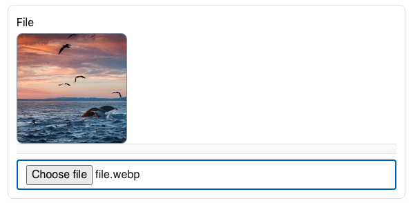

| **Name** | **Description**                                              | **e.g**                                                             |
| -------- | ------------------------------------------------------------ | ------------------------------------------------------------------- |
| id       | This id will be put as the name of the field / input element | ✔️                                                                  |
| type     | The type of the field                                        | upload                                                              |
| prefix   | This field will be put as the label before the field         |                                                                     |
| suffix   | This field will be put as the label after the field          |                                                                     |
| Label    | Label of the field                                           | File                                                                |
| accept   | Accept html file type.                                       | https://developer.mozilla.org/en-US/docs/Web/HTML/Attributes/accept |
| multiple | The field allows for the selection of multiple files.        | true / false                                                        |
| rules    | Validation rule for this field.                              | [Rules](#rules)                                                     |

### Rules

```json
  "rules": {
        "required": {
          "value": true,
          "message": "File is required"
        },
        "size": {
          "value": 100,
          "message": "File should be less than 100 Kb"
        },
        "resolution": {
          "value": {
            "width": 100,
            "height": 100
          },
          "message": "File should be 100 X 100"
        }
    }
```

## Preview


