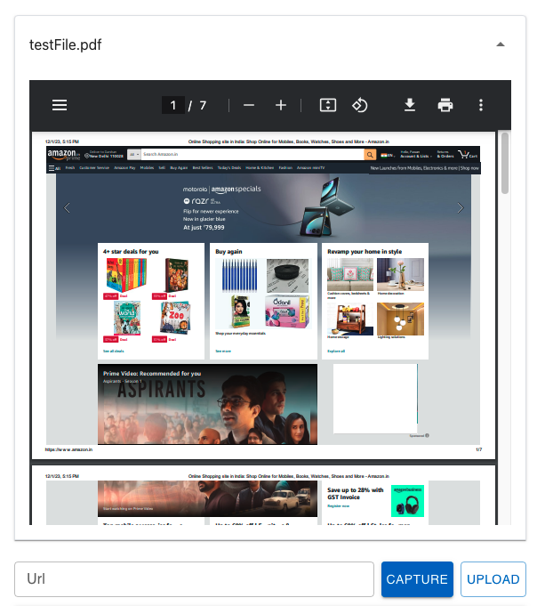

| **Name**    | **Description**                                              | **e.g**         |
| ----------- | ------------------------------------------------------------ | --------------- |
| id          | This id will be put as the name of the field / input element | ✔️              |
| type        | The type of the field                                        | weburl          |
| prefix      | This field will be put as the label before the field         | prefix string   |
| suffix      | This field will be put as the label after the field          | suffix string   |
| Label       | Label of the field                                           | Url             |
| Placeholder | The placeholder of the field                                 | Enter url       |
| rules       | Validation rule for this field.                              | [Rules](#rules) |

### Rules

```json
  "rules": {
      "required": {
        "value": true,
        "message": "Please enter url"
      }
    }
```

## Preview


