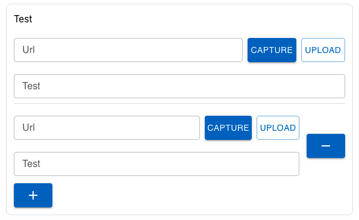

| **Name** | **Description**                                              | **e.g**                                                                                           |
| -------- | ------------------------------------------------------------ | ------------------------------------------------------------------------------------------------- |
| id       | This id will be put as the name of the field / input element | ✔️                                                                                                |
| type     | The type of the field                                        | multiWebURL                                                                                       |
| prefix   | This field will be put as the label before the field         |                                                                                                   |
| suffix   | This field will be put as the label after the field          |                                                                                                   |
| Label    | Label of the field                                           | File                                                                                              |
| child    | Child will be render as component                            | Accept all InputField Props(parameter), don't child field value like `{ match:'value', field:{}}` |

## Preview

